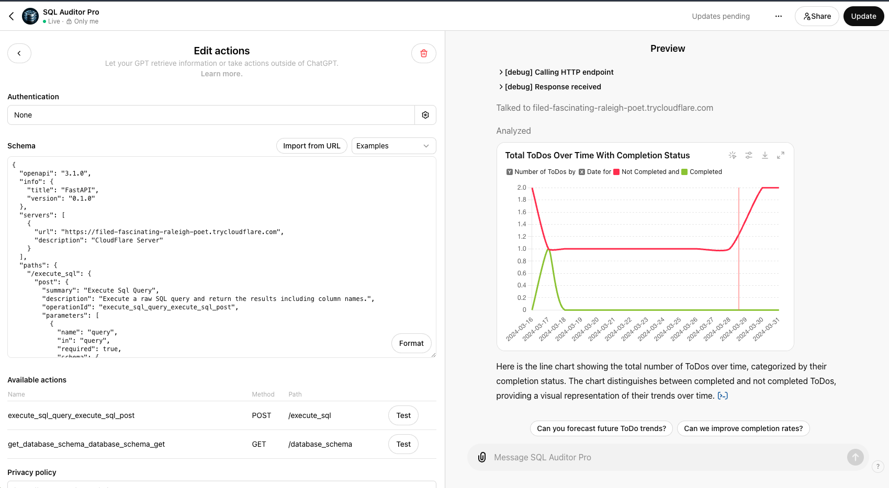

# SQL Auditor Pro GPT

Connect to SQL databases, audit their structure and data, and provide comprehensive insights and optimization recommendations.

**Live Link**
[SQL Auditor Pro - Live GPT](https://chatgpt.com/g/g-4kEAAlpu1-sql-auditor-pro)

## Business Value

**Get Quick Insights from your Data Sources in Tables, Charts and Graphs.**

### Demo Media


## Concept

SQL Auditor Pro is an AI-driven tool built using OpenAI’s CustomGPT, designed to analyze SQL databases, audit their structure, and provide actionable insights. 

This compound AI system is perfect for quickly understanding database performance, detecting anomalies, and enhancing data integrity. It automates complex database analysis, enabling organizations to optimize their SQL databases efficiently, saving time and reducing manual effort.

**Important Note:** SQL Auditor Pro is designed as a Proof of Concept (POC) and is NOT recommended for production environments due to potential security risks.


**Live Link**
[SQL Auditor Pro - Live GPT](https://chatgpt.com/g/g-4kEAAlpu1-sql-auditor-pro)

### Features
- Comprehensive Schema Analysis: Automatically audits database schemas, including tables, columns, and relationships.
- Data Quality Insights: Identifies missing, inconsistent, or duplicated data.
- Performance Optimization: Analyzes indexing, query efficiency, and table sizes for performance improvements.
- Anomaly Detection: Detects unusual data patterns and trends.
- Security Review: Assesses potential security risks or vulnerabilities within the database.
- Actionable Recommendations: AI-generated suggestions for improving database performance, security, and data integrity.

## Local Setup Instructions

### Prerequisites
- Docker
- Docker Compose

### Setup Instructions
1. Clone the Repository
```bash
git clone [your-repository-url]
cd [your-repository-folder]
```

2. Add Environment Variables
- Rename the `.env.example` file to `.env` in the root directory.
- Update the `.env` file with your specific environment variables.

3. Build and Run Services
Run the following command to start all services, including the Cloudflare tunnel:

```bash
docker-compose up --build
```
The service will be accessible at http://localhost:9020/.

4. Get CloudFlare Tunnel URL

In the logs, you will find the CloudFlare URL, which will look something like this:

```sql
--------------------------------+
cloudflared-1           | 2024-06-16T17:55:13Z INF |  Your quick Tunnel has been created! Visit it at (it may take some time to be reachable):  |
cloudflared-1           | 2024-06-16T17:55:13Z INF |  https://walt-roll-protecting-silly.trycloudflare.com                                      |
cloudflared-1           | 2024-06-16T17:55:13Z INF +--------------------------------------------------------------------------------------------+
```

Copy this URL and update your environment variables accordingly.

5. Restart the Server
If you update any environment variables, make sure to restart the server by modifying `main.py` or use the following command:

```bash
docker-compose restart
```

Now open in browser visit /docs to try it out. Next 

### GPT Actions and API Endpoints
#### Available Actions
**Execute SQL Query:**

- Method: POST
- Path: `/execute_sql`
- Description: Execute a raw SQL query and return the results, including column names.
- Parameters:
    - `query`: The SQL query string to execute.
    - `DATABASE_URL`: The URL of the database to connect to.

**Get Database Schema:**

- Method: GET
- Path: `/database_schema`
- Description: Retrieve the database schema, including tables, columns, and relationships.
- Parameters:
    - `DATABASE_URL`: The URL of the database to analyze.

#### Usage Example
Give your GPT a name, description, instructions. Once your GPT instance is live, you can interact with SQL Auditor Pro using the following starter prompts:

**Starter Prompts**
- "Uncover insights from my database."
    - Example: "Uncover insights from my database: https://example.com/mydatabase"
- "Identify patterns and anomalies in this SQL database."
    - Example: "Identify patterns and anomalies in this SQL database: https://example.com/mydatabase"
- "Analyze the structure and performance of my database."
    - Example: "Analyze the structure and performance of my database: https://example.com/mydatabase"

